<h1> Impy (Images in python) </h1>
<p>Impy is a library used for deep learning projects that use image datasets.</p>
<ul>
  <li><strong>Email: </strong>lozuwaucb@gmail.com</li>
  <li><strong>Bug reports: </strong>https://github.com/lozuwa/impy/issues</li>
</ul>
<p>It provides:</p>
<ul>
  <li>Data augmentation methods for images with bounding boxes (the bounding boxes are also affected by the transformations so you don't have to label again.)</li>
  <li>Fast image preprocessing methods useful in a deep learning context. E.g: if your image is too big you need to divide it into patches.</li>
</ul>

<ol>
	<li><a href="installation">Installation</a></li>
	<li><a href="tutorial">Tutorial</a></li>
	<li><a href="documentation">Documentation</a></li>
	<li><a href="contribute">Contribute</a></li>
</ol>

<h1 id="#installation">Installation</h1>

<h2>Download the impy.whl and use pip to install it.</h2>
<p>Follow the next steps:</p>

<ul>
	<li>Download the impy.whl from <a href="https://github.com/lozuwa/impy/releases/download/impy-0.1/impy-0.1-py3-none-any.whl">here</a></li>
</ul>

<ul>
	<li>Use pip to install the wheel</li>
</ul>

```bash
pip install impy-0.1-py3-none-any.whl
```

<h1 id="#tutorial">Tutorial</h1>
<p>Impy has multiple features that allow you to solve several different problems with a few lines of code. In order to showcase the features of impy we are going to solve common problems that involve both Computer Vision and Deep Learning. </p>
<p>We are going to work with a mini-dataset of cars and pedestrians (available <a href="https://github.com/lozuwa/cars_dataset">here</a>). This dataset has object annotations that make it suitable to solve a localization problem. </p>

<!--  -->
<!-- </img> -->

<h2>Object localization</h2>
<p>In this section we are going to solve problems related with object localization.</p>

<h3>Images are too big</h3>
<p>One common problem in Computer Vision and CNNs is dealing with big images. Let's sample one of the images from our mini-dataset: </p>

<!--  -->
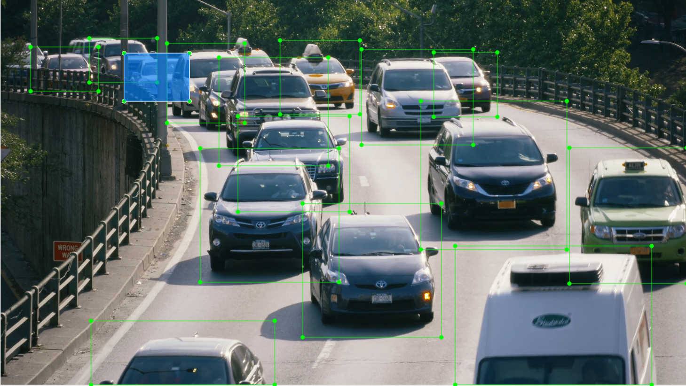</img>

<p>The size of this image is 3840x2160. It is too big for training. Most likely, your computer will run out of memory. In order to try to solve the big image problem, we could reduce the size of the mini-batch hyperparameter. But if the image is too big it would still not work. We could also try to reduce the size of the image. But that means the image losses quality and you would need to label the smaller image again. </p>
<p>Instead of hacking a solution, we are going to solve the problem efficiently. The best solution is to sample crops of a specific size that contain the maximum amount of bounding boxes possible. Crops of 1032x1032 pixels are usually small enough.</p>

<p>Let's see how to do this with impy:</p>

<ul>
	<li>Create a folder named <b>testing_cars</b>. Then enter the folder.</li>
</ul>

```bash
	mkdir -p $PWD/testing_cars
	cd testing_cars
```

<ul>
	<li>Download the cars dataset from <a href="https://github.com/lozuwa/cars_dataset">here</a></li>
</ul>

```bash
git clone https://github.com/lozuwa/cars_dataset
```

<ul>
	<li>Create a file named reducing_big_images.py and put the next code:</li>
</ul>

```python
import os
from impy.ObjectDetectionDataset import ObjectDetectionDataset

def main():
	# Define the path to images and annotations
	images_path:str = os.path.join(os.getcwd(), "cars_dataset", "images")
	annotations_path:str = os.path.join(os.getcwd(), "cars_dataset", "annotations", "xmls")
	# Define the name of the dataset
	dbName:str = "CarsDataset"
	# Create an object of ObjectDetectionDataset
	obda:any = ObjectDetectionDataset(imagesDirectory=images_path, annotationsDirectory=annotations_path, databaseName=dbName)
	# Reduce the dataset to smaller Rois of smaller ROIs of shape 1032x1032.
	offset:list=[1032, 1032]
	images_output_path:str = os.path.join(os.getcwd(), "cars_dataset", "images_reduced")
	annotations_output_path:str = os.path.join(os.getcwd(), "cars_dataset", "annotations_reduced", "xmls")
	obda.reduceDatasetByRois(offset = offset, outputImageDirectory = images_output_path, outputAnnotationDirectory = annotations_output_path)

if __name__ == "__main__":
	main()
```

<ul>
	<li><b>Note</b> the paths where we are going to store the reduced images don't exist. Let's create them.</li>
</ul>

```bash
mkdir -p $PWD/cars_dataset/images_reduced/
mkdir -p $PWD/cars_dataset/annotations_reduced/xmls/
```

<ul>
	<li>Now we can run the script and reduce the images to smaller crops.</li>
</ul>

```bash
python reducing_big_images.py
```

<p>Impy will create a new set of images and annotations with the size specified by offset and will include the maximum number of annotations possible so you will end up with an optimal number of data points. Let's see the results of the example: </p>

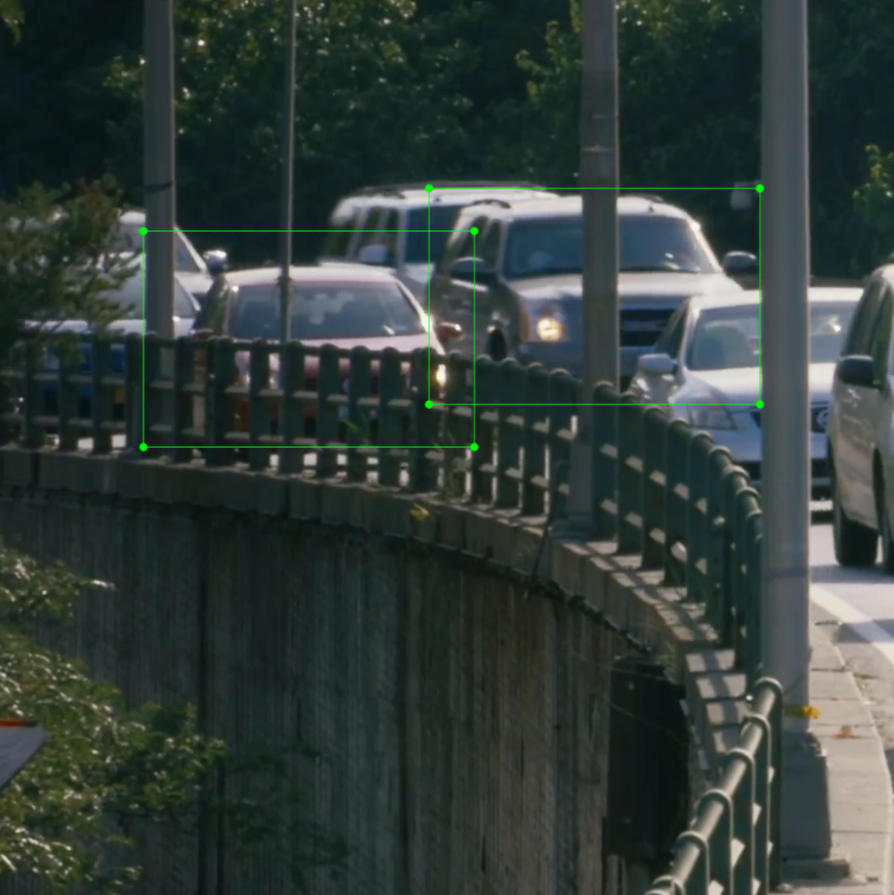</img>
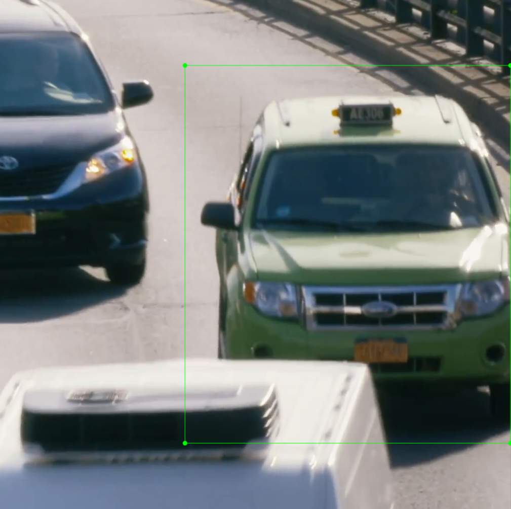</img>
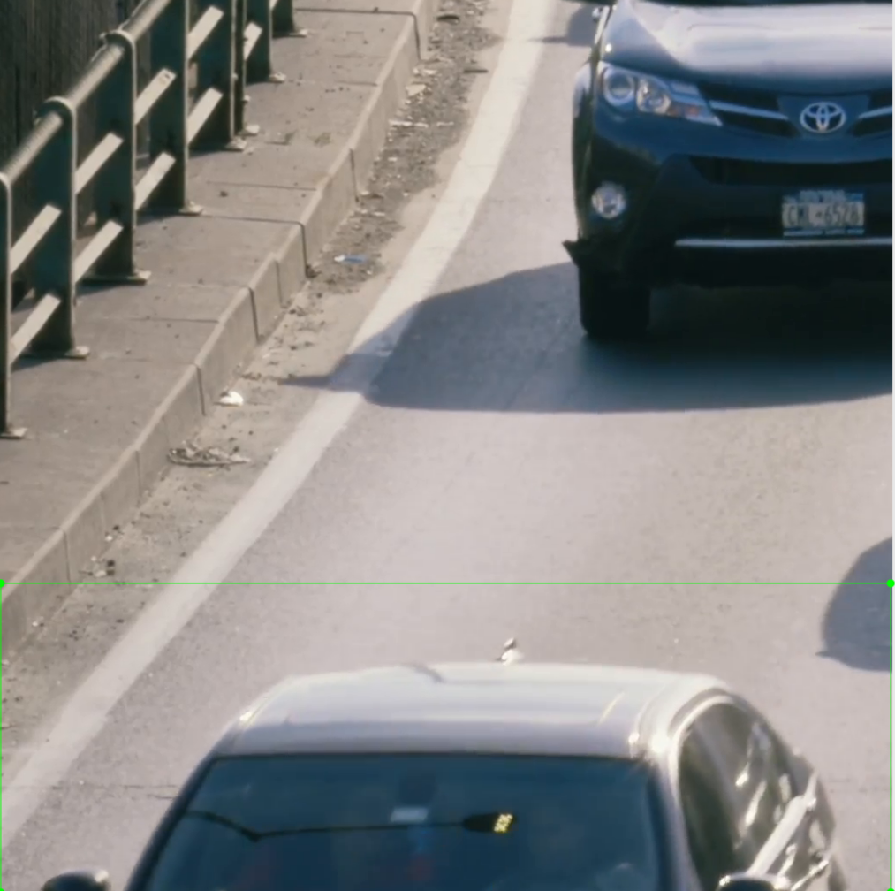</img>
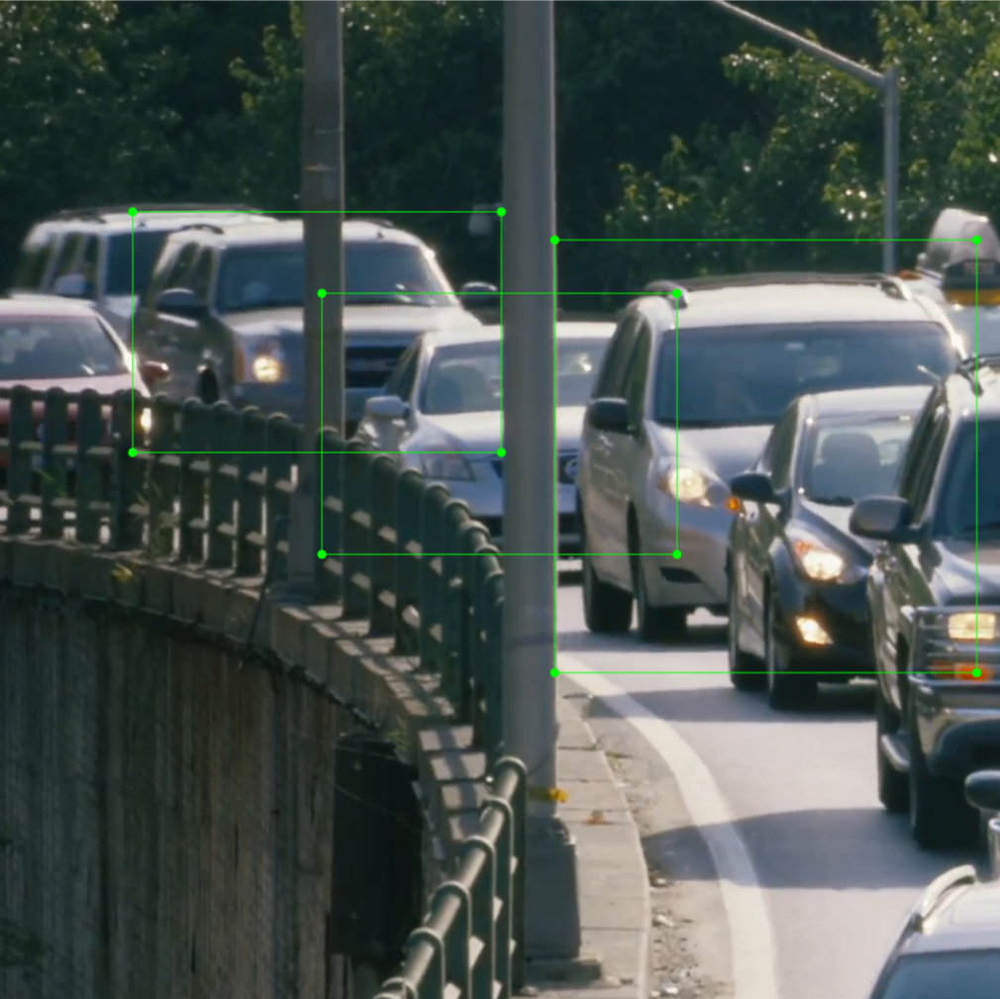</img>
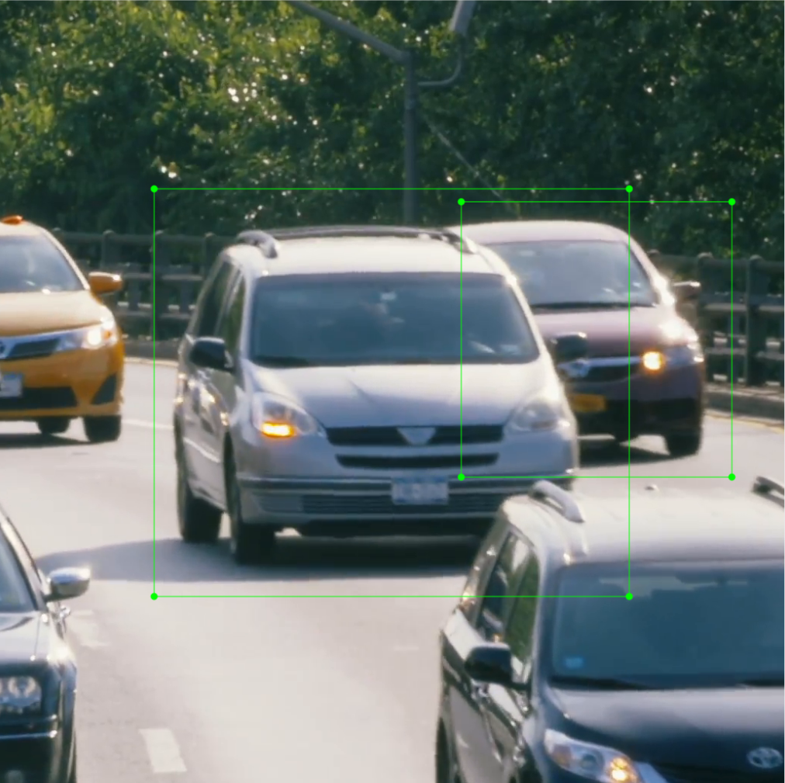</img>
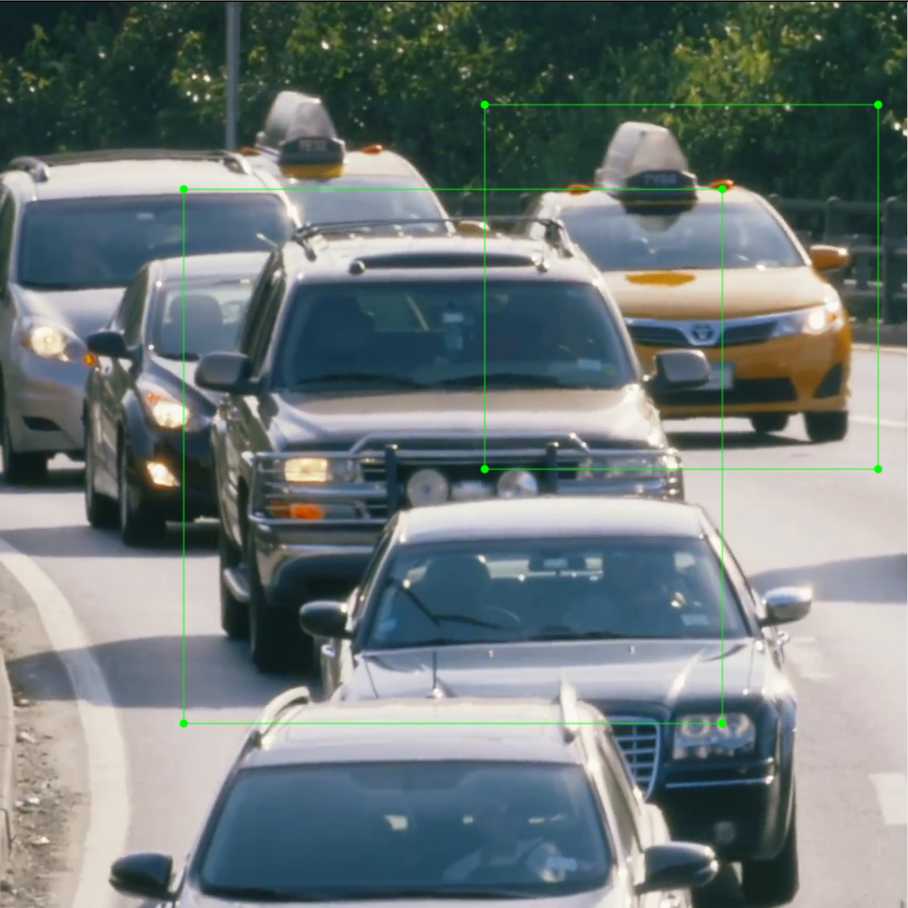</img>
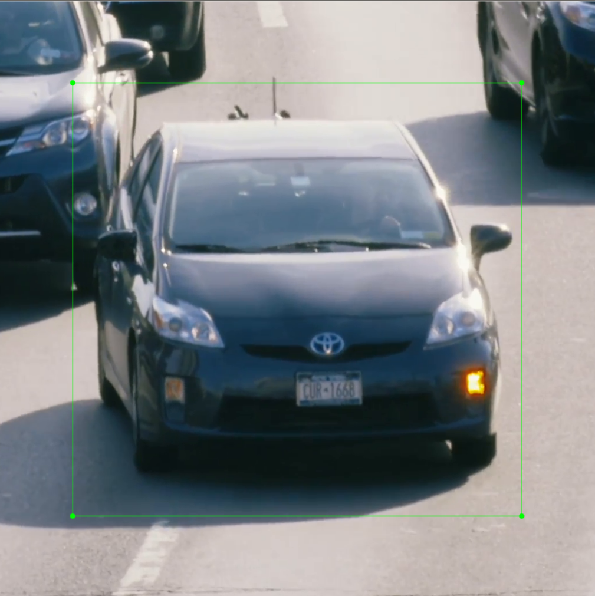</img>
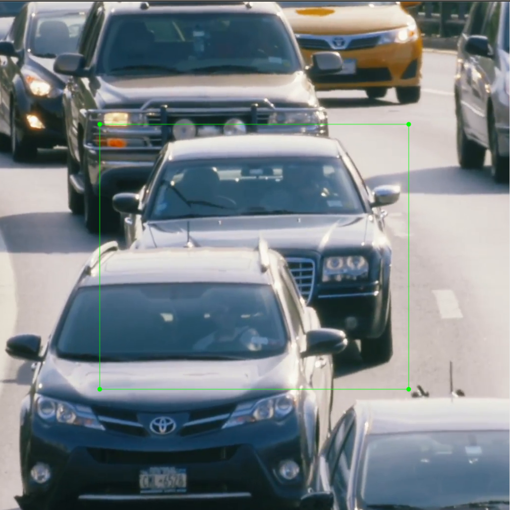</img>
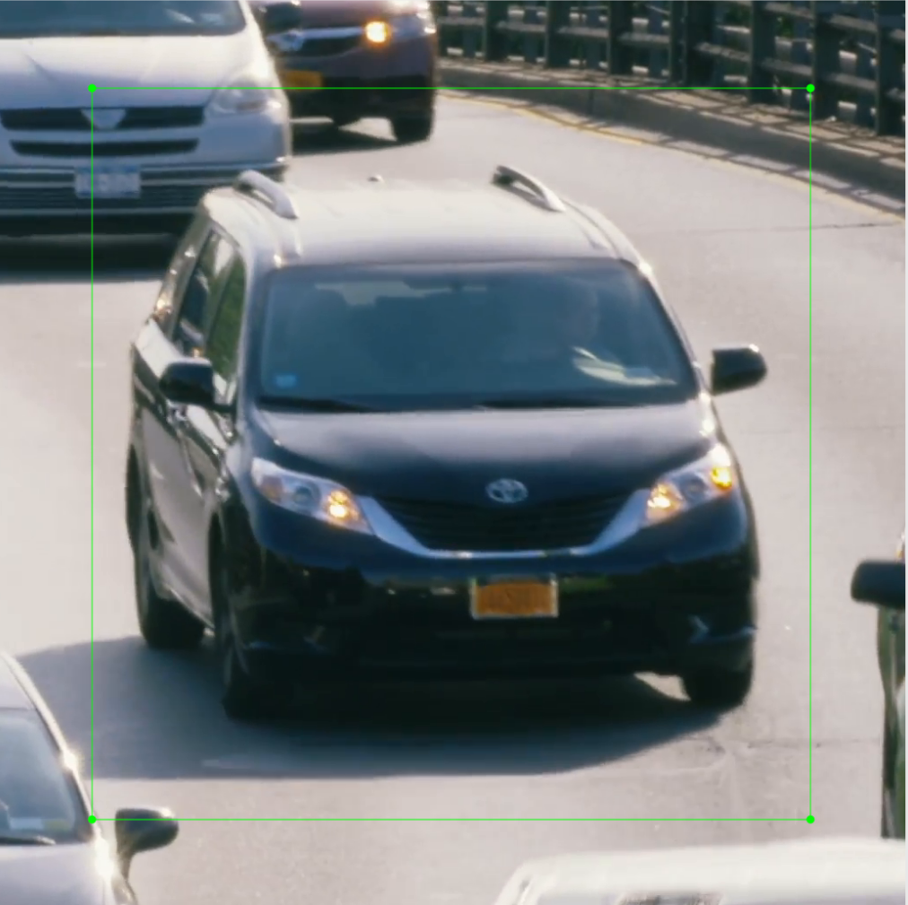</img>
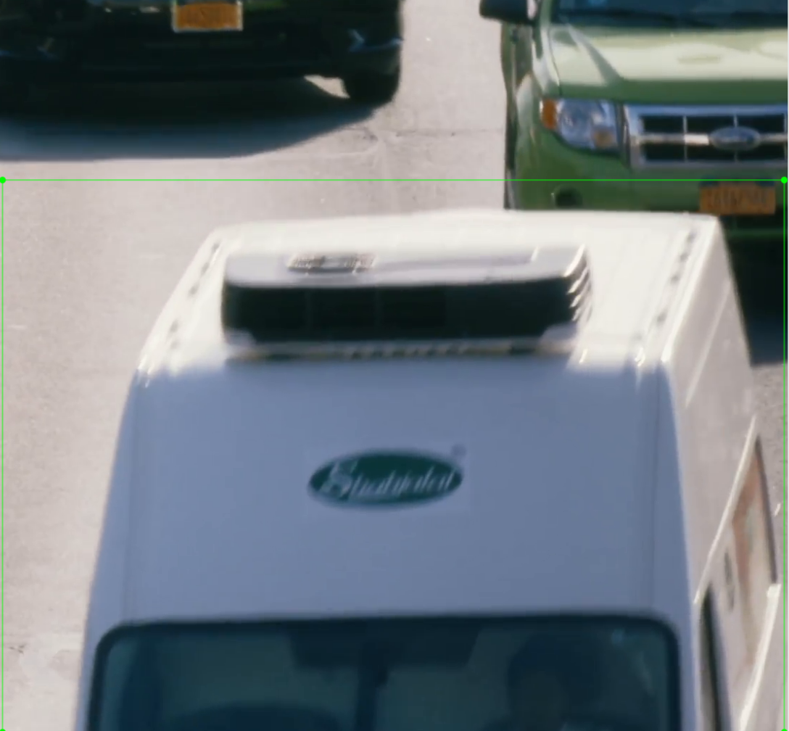</img>
</img>

<p>As you can see the bounding boxes have been maintained and small crops of the big image are now available. We can use this images for training and our problem is solved.</p>

<p><strong>Note</strong> that in some cases you are going to end up with an inefficient amount of crops due to overlapping crops in the clustering algorithm. I am working on this and a better solution will be released soon. Nonetheless, these results are still way more efficient than what is usually done which is crop each bounding box one by one (This leads to inefficient memory usage, repeated data points, lose of context and simpler representation.).</p>

<h3>Data augmentation for bounding boxes</h3>
<p>Another common problem in Computer Vision and CNNs for object localization is data augmentation. Specifically space augmentations (e.g: scaling, cropping, rotation, etc.). For this you would usually make a custom script. But with impy we can make this easier.</p>

<ul>
	<li>Create a json file named <b>augmentation_configuration.json</b></li>
</ul>

```bash
touch augmentation_configuration.json
```

<ul>
	<li>Insert the following code in the <b>augmentation_configuration.json</b> file</li>
</ul>

```json
{
	"multiple_image_augmentations": {
		"Sequential": [
			{
				"image_color_augmenters": {
					"Sequential": [
						{
							"sharpening": {
								"weight": 2.0,
								"save": true,
								"restartFrame": false,
								"randomEvent": false
							}
						}
					]
				}
			},
			{
				"bounding_box_augmenters": {
					"Sequential": [
						{
							"scale": {
								"size": [1.2, 1.2],
								"zoom": true,
								"interpolationMethod": 1,
								"save": true,
								"restartFrame": false,
								"randomEvent": false
							}
						},
						{
							"verticalFlip": {
								"save": true,
								"restartFrame": false,
								"randomEvent": true
							}
						}
					]
				}
			},
			{
				"image_color_augmenters": {
					"Sequential": [
						{
							"histogramEqualization":{
								"equalizationType": 1,
								"save": true,
								"restartFrame": false,
								"randomEvent": false
							}
						}
					]
				}
			},
			{
				"bounding_box_augmenters": {
					"Sequential": [
						{
							"horizontalFlip": {
								"save": true,
								"restartFrame": false,
								"randomEvent": false
							}
						},
						{
							"crop": {
								"save": true,
								"restartFrame": true,
								"randomEvent": false
							}
						}
					]
				}
			}
		]
	}
}
```

<p>Let's analyze the configuration file step by step. Currently, this is the most complex type of data augmentation you can achieve with the library.</p>
<p>Note the file starts with "multiple_image_augmentations", then a "Sequential" key follows. Inside "Sequential" we define an array. This is important, each element of the array is a type of augmenter.</p>
<p>The first augmenter we are going to define is a "image_color_agumenters" which is going to execute a sequence of color augmentations. In this case, we have defined only one type of color augmentation which is sharpening with a weight of 2.0.</p>
<p>After the color augmentation, we have defined a "bounding_box_augmenters" which is going to execute a "scale" augmentation with zoom  followed by a "verticalFlip".</p>
<p>We want to keep going. So we define two more types of image augmenters. Another "image_color_augmenters" which applies "histogramEqualization" to the image. And another "bounding_box_agumeneters" which applies a "horizontalFlip" and a "crop" augmentation.</p>

<p>Note there are three types of parameters in each augmenter. These are optional, but I recommend specifying them in order to fully understand your pipeline. These parameters are:</p>

<ol>
	<li><strong>"Save"</strong>: saves the current transformation if True.</li>
	<li><strong>"Restart frame"</strong>: restarts the frame to its original space if True, otherwise maintains the augmentation applied so far.</li>
	<li><strong>"Random event"</strong>: uses an stochastic function to randomize whether this augmentation might be applied or not.</li>
</ol>

<p>As you have seen we can define any type of crazy configuration and augment our images with the available methods while choosing whether to save each augmentation, restart the frame to its original space or randomize the event so we make things crazier. Get creative and define your own data augmentation pipelines.</p>

<p>Once the configuration file is created, we can apply the data augmentation pipeline with the following code.</p>

<ul>
	<li>After defining the augmentation file, let's create the code to apply the augmentations. Create a file named: <b>apply_bounding_box_augmentations.py</b></li>
</ul>

<ul>
	<li>Insert the following code to <b>apply_bounding_box_augmentations.py</b></li>
</ul>

```python
import os
from impy.ObjectDetectionDataset import ObjectDetectionDataset

def main():
	# Define the path to images and annotations
	images_path:str=os.path.join(os.getcwd(), "cars_dataset", "images")
	annotations_path:str=os.path.join(os.getcwd(), "cars_dataset", "annotations", "xmls")
	# Define the name of the dataset
	dbName:str="CarsDataset"
	# Create an ObjectDetectionDataset object
	obda:any=ObjectDetectionDataset(imagesDirectory=images_path, annotationsDirectory=annotations_path, databaseName=dbName)
	# Apply data augmentation by using the following method of the ObjectDetectionDataset class.
	configuration_file:str=os.path.join(os.getcwd(), "augmentation_configuration.json")
	images_output_path:str=os.path.join(os.getcwd(), "cars_dataset", "images_augmented")
	annotations_output_path:str=os.path.join(os.getcwd(), "cars_dataset", "annotations_augmented", "xmls")
	obda.applyDataAugmentation(configurationFile=configuration_file, outputImageDirectory=images_output_path, outputAnnotationDirectory=annotations_output_path)

if __name__ == "__main__":
	main()
```

<ul>
	<li>Now execute the scrip running:</li>
</ul>

```bash
python apply_bounding_box_augmentations.py
```

<p>Next I present the results of the augmentations. Note the transformation does not alter the bounding boxes of the image which saves you a lot of time in case you want to increase the representational complexity of your data.</p>

<h3>Sharpening</h3>
</img>

<h3>Scaling (image gets a little bit bigger)</h3>
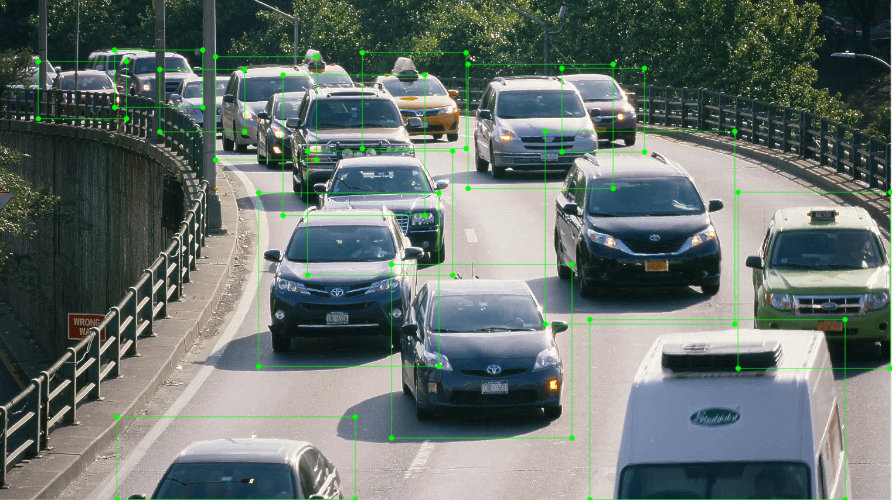</img>

<h3>Vertical flip</h3>
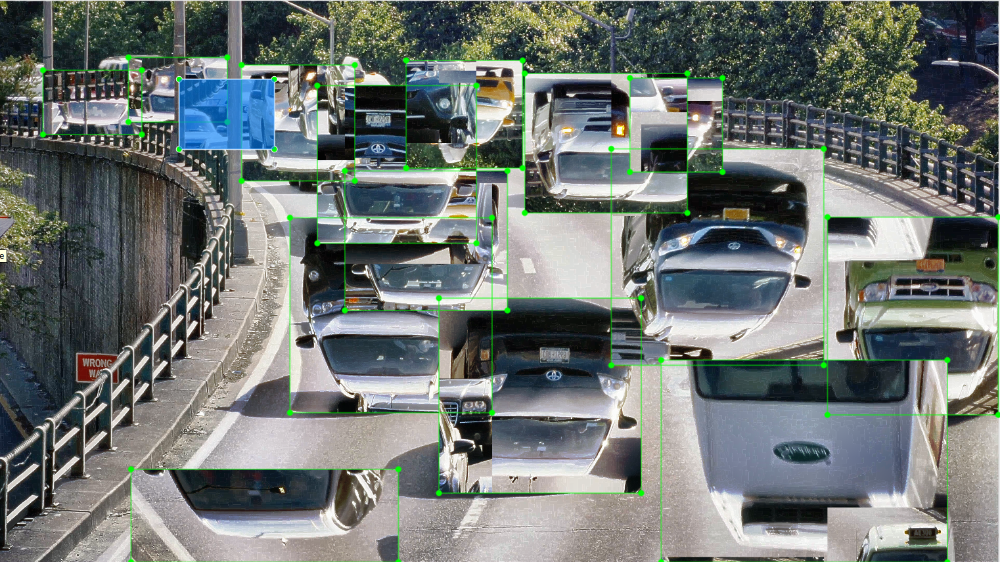</img>

<h3>Histogram equalization</h3>
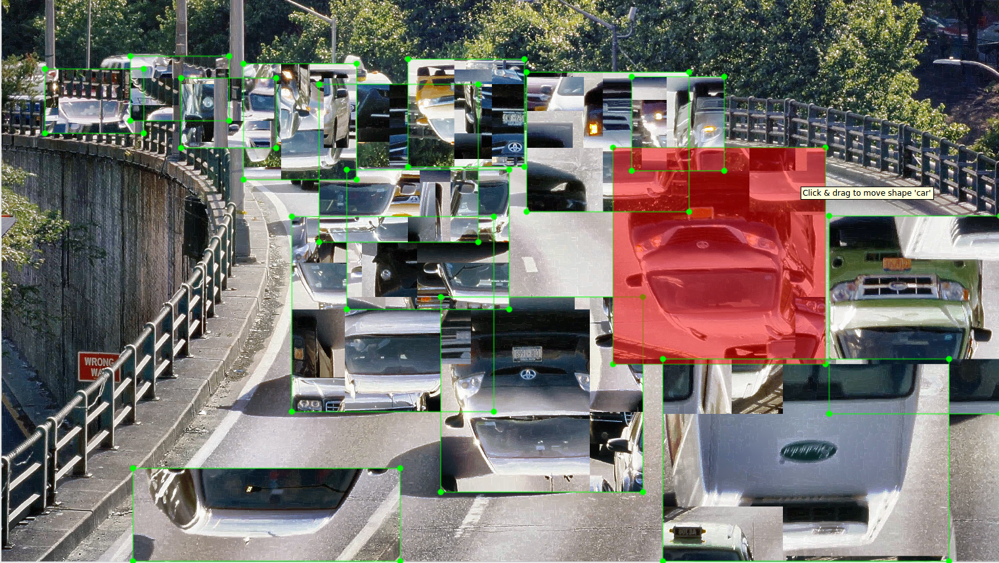</img>

<h3>Horizontal flip</h3>
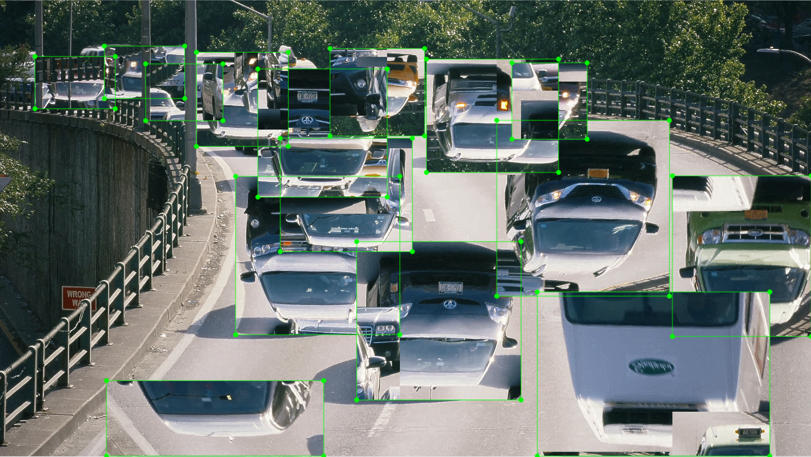</img>

<h3>Crop bounding boxes</h3>
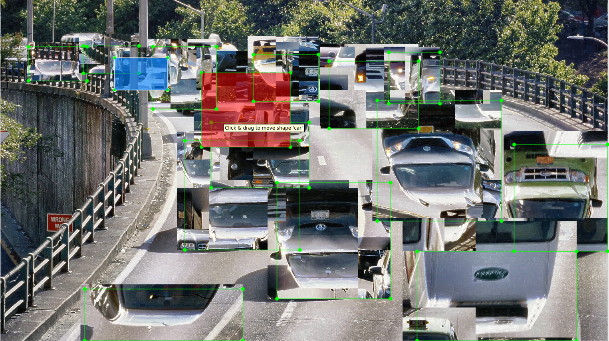</img>

<h1 id="#documentation">Documentation</h1>
<h2>Object detection dataset</h2>
<h3>ObjectDetectionDataset class</h3>
<p>A class that holds a detection dataset. Parameters: </p>
<ol>
	<li><strong>imagesDirectory:</strong> A string that contains a path to a directory of images.</li>
	<li><strong>annotationsDirectory:</strong> A string that contains a path to a directory of xml annotations.</li>
	<li><strong>databaseName:</strong> A string that contains a name.</li>
</ol>
<p>Class methods:</p>
<h4>dataConsistency</h4>
<p>Checks the consistency of the image files with the annotation files.</p>

<h4>findEmptyOrWrongAnnotations</h4>
Examines all the annotations in the dataset and detects if any is empty or wrong. A wrong annotation is said to contain a bounding box coordinate that is either greater than width/heigh respectively or is less than zero. 
<ol>
	<li><strong>removeEmpty:</strong> A boolean that if True removes the annotations that are considered to be wrong or empty.</li>
</ol>

<h4>computeBoundingBoxStats</h4>
<ol>
	<li><strong>saveDataFrame:</strong> A boolean that if True saves the dataframe with the stats. </li>
	<li><strong>outputDirDataFrame:</strong> A string that contains a valid path.</li>
</ol>

<h4>saveBoundingBoxes</h4>
<p>Saves the bounding boxes of the data set as images. Parameters:</p>
<ol>
	<li><strong>outputDirectory:</strong> A string that contains a path to a valid directory.</li>
	<li><strong>filterClasses:</strong> A list of strings that contains classes that are supposed to be as labels in the dataset annotations.</li>
</ol>

<h4>reduceDatasetByRois</h4>
<p>Iterate over images and annotations and execute redueImageDataPointByRoi for each one.</p>
<ol>
	<li><strong>offset:</strong> A list or tuple of ints.</li>
	<li><strong>outputImageDirectory:</strong> A string that contains a valid path.</li>	
	<li><strong>outputAnnotationDirectory:</strong> A string that contains a valid path.</li>	
</ol>

<h4>reduceImageDataPointByRoi</h4>
<p></p>
<ol>
	<li><strong>imagePath:</strong> A string that contains the path to an image.</li>
	<li><strong>annotationPath:</strong> A string that contains a path to a xml annotation.</li>
	<li><strong>offset</strong> A list or tuple of ints.</li>
	<li><strong>outputImageDirectory:</strong> A string that contains a valid path.</li>
	<li><strong>outputAnnotationDirectory:</strong> A string that contains a valid path.</li>
</ol>

<h4>applyDataAugmentation</h4>
<p></p>
<ol>
	<li><strong>configurationFile:</strong> A string that contains a path to a json file.</li>
	<li><strong>outputImageDirectory:</strong> A string that contains a valid path.</li>
	<li><strong>outputAnnotationDirectory:</strong> A string that contains a valid path.</li>
	<li><strong>threshold:</strong> A float in the range [0-1].</li>
</ol>

<h4>__applyColorAugmentation__</h4>
<p></p>
<ol>
	<li><strong>frame:</strong> A numpy tensor that contains an image.</li>
	<li><strong>augmentationType:</strong> A string that contains a valid Impy augmentation type.</li>
	<li><strong>parameters:</strong> A list of strings that contains the respective parameters for the type of augmentation.</li>
</ol>

<h4>__applyBoundingBoxAugmentation__</h4>
<p></p>
<ol>
	<li><strong>frame:</strong> A numpy tensor that contains an image.</li>
	<li><strong>boundingBoxes:</strong> A list of lists of ints that contains coordinates for a bounding box.</li>
	<li><strong>augmentationType:</strong> A string that contains a valid Impy augmentation type.</li>
	<li><strong>parameters:</strong> A list of strings that contains the respective parameters for the type of augmentation.</li>
</ol>

<h2>Types of color augmentations</h2>
<p>All of the augmentations ought to implement the following parameters:</p>
<ol>
	<li><strong>"Save"</strong>: saves the current transformation if True.</li>
	<li><strong>"Restart frame"</strong>: restarts the frame to its original space if True, otherwise maintains the augmentation applied so far.</li>
	<li><strong>"Random event"</strong>: uses an stochastic function to randomize whether this augmentation might be applied or not.</li>
</ol>

<h3>Invert color</h3>
<p>Apply a bitwise_not operation to the pixels in the image. Code example: </p>

```json
{
	"invertColor": {
		"Cspace": [true, true, true]
	}
}
```

<h3>Histogram equalization</h3>
<p>Equalize the color space of the image. Code example: </p>

```json
{
	"histogramEqualization": {
		"equalizationType": 1
	}
}
```

<h3>Change brightness</h3>
<p>Multiply the pixel distribution with a scalar. Code example: </p>

```json
{
	"changeBrightness": {
		"coefficient": 1.2
	}
}
```

<h3>Random sharpening</h3>
<p>Apply a sharpening system to the image. Code example: </p>

```json
{
	"sharpening": {
		"weight": 0.8
	}
}
```

<h3>Add gaussian noise</h3>
<p>Add gaussian noise to the image. Code example: </p>
```json
{
	"addGaussianNoise": {
		"coefficient": 0.5
	}
}
```

<h3>Gaussian blur</h3>
<p>Apply a Gaussian low pass filter to the image. Code example: </p>

```json
{
	"gaussianBlur": {
		"sigma": 2
	}
}
```

<h3>Shift colors</h3>
<p>Shift the colors of the image. Code example: </p>

```json
{
	"shiftBlur": {
	}
}
```


<h2>Types of bounding box augmentations</h2>
<p>All of the augmentations ought to implement the following parameters:</p>
<ol>
	<li><strong>"Save"</strong>: saves the current transformation if True.</li>
	<li><strong>"Restart frame"</strong>: restarts the frame to its original space if True, otherwise maintains the augmentation applied so far.</li>
	<li><strong>"Random event"</strong>: uses an stochastic function to randomize whether this augmentation might be applied or not.</li>
</ol>
<h3>Scale</h3>
<p>Scales the size of an image and maintains the location of its bounding boxes. Code example:</p>

```json
{
	"scale": {
		"size": [1.2, 1.2],
		"zoom": true,
		"interpolationMethod": 1
	}
}
```

<h3>Random crop</h3>
<p>Crops the bounding boxes of an image. Specify the size of the crop in the size parameter. Code example:</p>

```json
{
	"crop": {
		"size": [50, 50]
	}
}
```

<h3>Random pad</h3>
<p>Pads the bounding boxes of an image. i.e adds pixels from outside the bounding box. Specify the amount of pixels to be added in the size parameter. Code example:</p>

```json
{
	"pad": {
		"size": [20, 20]
	}
}
```

<h3>Flip horizontally</h3>
<p>Flips the bounding boxes of an image in the x axis. Code example:</p>

```json
{
	"horizontalFlip": {
	}
}
```

<h3>Flip vertically</h3>
<p>Flips the bounding boxes of an image in the y axis. Code example:</p>

```json
{
	"verticalFlip": {
	}
}
```

<h3>Rotation</h3>
<p>Rotates the bounding boxes of an image anti-clockwise. Code example:</p>

```json
{
	"rotation": {
		"theta": 0.5 
	}
}
```

<h3>Jitter boxes</h3>
<p>Draws random squares of a specific color and size in the area of the bounding box. Code example: </p>

```json
{
	"jitterBoxes": {
		"size": [10, 10],
		"quantity": 5,
		"color": [255,255,255]
	}
}
```

<h3>Dropout</h3>
<p>Set pixels inside the bounding box to zero depending on a probability p extracted from a normal distribution. If p > threshold, then the pixel is changed. Code example: </p>

```json
{
	"dropout": {
		"size": [5, 5],
		"threshold": 0.8,
		"color": [255,255,255]
	}
}
```

<h1 id="#contribute">Contribute</h1>
<p>If you want to contribute to this library. Please follow the next steps so you can have a development environment.</p>

<ul>
	<li>Install anaconda with python 3.7< (tested with python 3.5 3.6 3.7). Then create an empty environment.</li>
</ul>

```bash
conda create --name=impy python3.7
```

<ul>
	<li>Activate the conda environment</li>
</ul>

```bash
source activate impy
```

<ul>
	<li>Clone the repository</li>
</ul>

```bash
git clone https://github.com/lozuwa/impy
```

<ul>
	<li>Install the dependencies that are in setup.py</li>
</ul>

<ul>
	<li>You are good to go. Note there are unit tests for each script inside the impy folder.</li>
</ul>

<h2>Build the project</h2>

<ul>
	<li>Go to impy's parent directory and run the following code:</li>
</ul>

```bash
python setup.py sdist bdist_wheel
```

<ul>
	<li>A folder named dist will appear. It contains the .whl and .tar.gz</li>
</ul>
